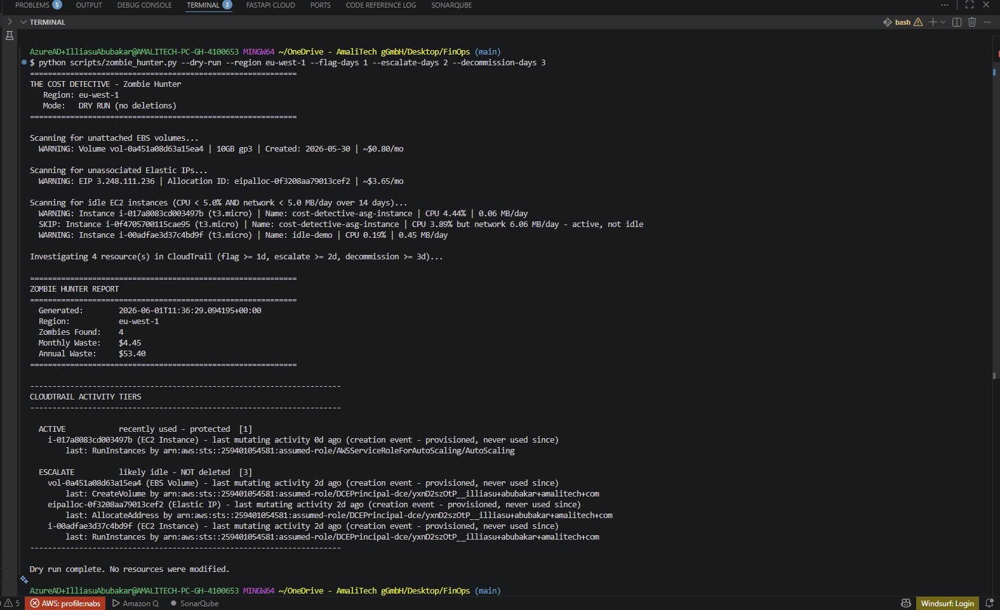
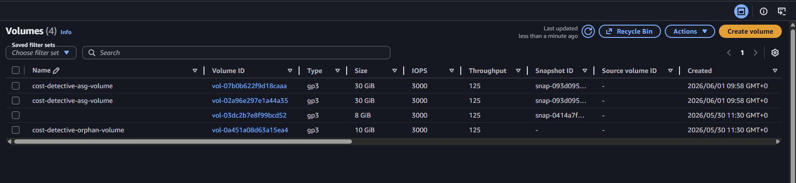
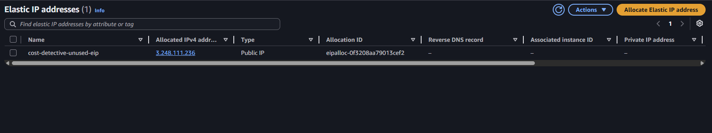
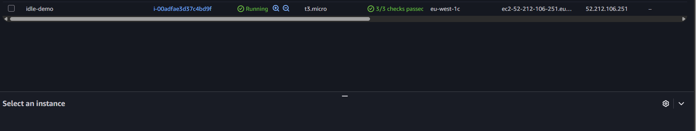
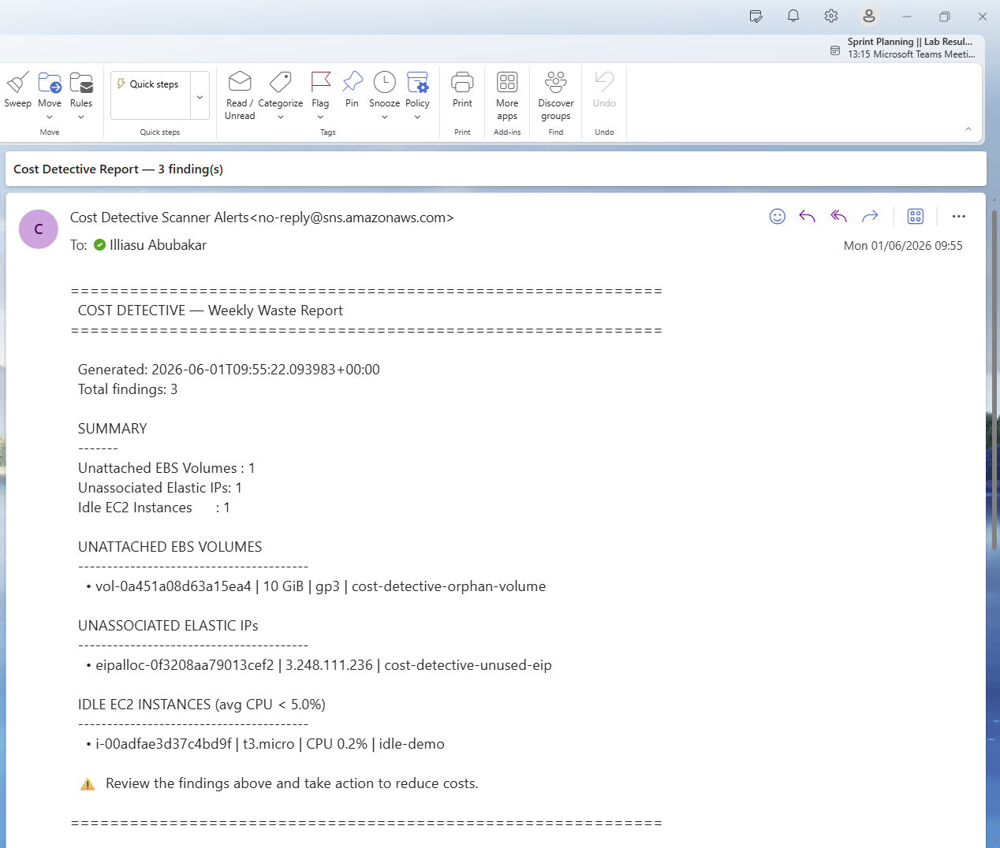
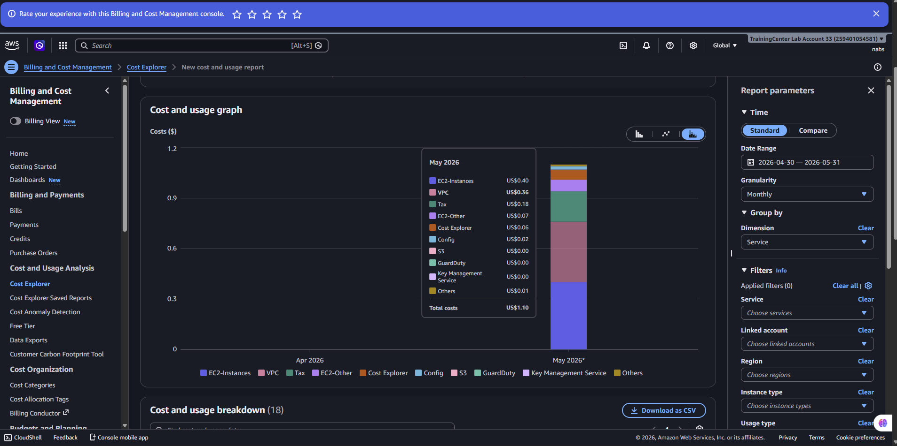

# The Cost Detective — AWS FinOps Audit

**Scenario:** An AWS account inherited from a previous team has been managed without cost discipline. The objective of this project is to identify waste, implement governance and active cost controls, introduce a cost-aware architecture, and document the work for audit submission and a live walkthrough.

The toolkit has two halves:

| Half | Purpose | Execution model |
|------|---------|-----------------|
| `scripts/` | Identify and decommission waste (the investigative work) | Run manually, on demand |
| `terraform/` | Prevent and monitor waste going forward (governance and automation) | Deployed once, runs autonomously |

The scripts find and remove existing waste; the Terraform stack stops the account from returning to its prior state.

---

## Objectives and Where They Are Delivered

| # | Objective | Delivered by |
|---|-----------|--------------|
| 1 | Analyze spend and identify zombie (waste) assets | `zombie_hunter.py`, `cloudtrail_tracker.py`, `tagging_compliance.py` |
| 2 | Active cost controls (budgets and alerts) | `terraform/budgets/` |
| 3 | Cost-aware architecture (Spot instances) | `terraform/asg-spot/` |
| 4 | Automation (scheduled scans) | `terraform/lambda-scanner/` |
| 5 | Governance (tag enforcement) | `terraform/config-rules/` |
| 6 | Documentation | `docs/` and this README |

---

## Project Structure

```
FinOps/
├── scripts/
│   ├── zombie_hunter.py          # Detect, tier, and optionally decommission waste
│   ├── zombie_hunter_enhanced.py # Detection-only variant with confidence scores
│   ├── cloudtrail_tracker.py     # Last-activity lookup for a single resource
│   ├── tagging_compliance.py     # Report resources missing required cost tags
│   └── create_sandbox_waste.py   # Create or tear down demo waste for testing
├── terraform/
│   ├── main.tf, variables.tf, outputs.tf, terraform.tfvars   # Umbrella root
│   ├── budgets/                  # AWS Budget and SNS email alerts
│   ├── config-rules/             # AWS Config tagging enforcement
│   ├── asg-spot/                 # Auto Scaling Group with On-Demand and Spot mix
│   └── lambda-scanner/           # Lambda and EventBridge weekly waste scan
├── docs/
│   ├── cost-optimization-guide.md
│   ├── tagging-policy.md
│   └── runbooks/
│       ├── zombie-cleanup.md
│       ├── budget-alert-response.md
│       ├── tagging-noncompliance.md
│       ├── spot-interruption.md
│       └── weekly-scan-review.md
├── pics/                         # Audit evidence (screenshots)
├── requirements.txt
└── README.md
```

---

## Prerequisites

- Python 3.9 or later, with dependencies installed: `pip install -r requirements.txt`
- Terraform v1.5 or later
- AWS credentials configured (`aws configure`, an SSO/role profile, or environment variables). Verify with `aws sts get-caller-identity`.
- Region: this project standardizes on `eu-west-1`.
- IAM permissions: see [IAM Permissions](#iam-permissions) below.

---

## Quick Start

```bash
# 1. Install dependencies
pip install -r requirements.txt

# 2. (Optional) Create demo waste to detect
python scripts/create_sandbox_waste.py --region eu-west-1

# 3. Detect waste (read-only; investigates each resource in CloudTrail)
python scripts/zombie_hunter.py --dry-run --region eu-west-1 --output report.json

# 4. Deploy governance and automation (umbrella deploys all four modules)
cd terraform
terraform init
terraform plan
terraform apply        # alert_email is read from terraform.tfvars

# 5. When finished, tear everything down
cd terraform && terraform destroy
python scripts/create_sandbox_waste.py --region eu-west-1 --cleanup
```

---

## The Zombie Hunter

`zombie_hunter.py` performs three steps in order: detect waste by resource state, investigate each item in CloudTrail, and (only with `--execute`) decommission what is provably idle.


### What It Detects

| Waste type | Detection criterion | Why it is waste |
|------------|--------------------|-----------------|
| Unattached EBS volume | status is `available` | Billed storage attached to nothing |
| Unassociated Elastic IP | no association | Charged monthly for an idle address |
| Idle EC2 instance | CPU below 5% AND network below 5 MB/day over the lookback window | Paying for a host doing no work |

Idle detection requires both low CPU and low network, so a low-CPU but otherwise busy service (DNS resolver, license server, proxy) is not misclassified as idle. In the screenshot above, an ASG instance with 6.06 MB/day of network traffic is correctly skipped as active.

### The CloudTrail Lifecycle Gate

Before deletion, every resource is investigated in CloudTrail and placed in a tier based on the number of days since its last mutating API activity. Only the `SAFE` tier is ever eligible for deletion.

| Tier | Condition | Action |
|------|-----------|--------|
| `EXEMPT` | Carries the exemption tag (default `DoNotDelete`) | Never deleted |
| `ACTIVE` | Idle less than `--flag-days` (default 7) | Protected; recently used |
| `FLAG` | Idle 7 to 13 days | Surfaced for review or owner follow-up; not deleted |
| `ESCALATE` | Idle 14 to 29 days | Likely idle; not deleted |
| `SAFE` | Idle `--decommission-days` or more (default 30) | Confirmed waste; the only deletable tier |
| `INCONCLUSIVE` | No mutating activity found (ambiguous) | Protected; investigate manually |
| `UNVERIFIABLE` | CloudTrail error or access denied | Protected; fail-safe |
| `NOT_INVESTIGATED` | `--skip-cloudtrail` used | Protected |

Design principles: read-only events are ignored (so monitoring tools polling `Describe*` do not keep a resource permanently "active"); Elastic IPs are looked up by both allocation ID and public IP; and anything that cannot be verified is protected rather than deleted.

The thresholds are configurable. The screenshot below tightens them to 1/2/3 days, which reclassifies the two-day-old sandbox resources from `ACTIVE` into `ESCALATE`:



### Usage

```bash
# Detect and tier (read-only)
python scripts/zombie_hunter.py --dry-run --region eu-west-1 --output report.json

# Decommission only the SAFE tier (prompts for confirmation)
python scripts/zombie_hunter.py --execute --region eu-west-1

# Tune the lifecycle thresholds
python scripts/zombie_hunter.py --dry-run --flag-days 7 --escalate-days 14 --decommission-days 30

# Non-interactive (refuses to run on a non-TTY without --yes)
python scripts/zombie_hunter.py --execute --yes --region eu-west-1
```

### Key Flags

| Flag | Default | Purpose |
|------|---------|---------|
| `--dry-run` / `--execute` | — | Detection only versus deleting the SAFE tier (one is required) |
| `--region` | `eu-west-1` | AWS region to scan |
| `--output FILE` | — | Save the JSON report |
| `--flag-days` / `--escalate-days` / `--decommission-days` | 7 / 14 / 30 | Lifecycle tier thresholds (must form an ascending ladder) |
| `--idle-lookback-days` | 14 | CPU and network window for idle EC2 |
| `--network-idle-mb-per-day` | 5.0 | Network threshold for "idle" |
| `--exempt-tag` | `DoNotDelete` | Tag key that exempts a resource from deletion |
| `--treat-no-activity-as-idle` | off | Treat `INCONCLUSIVE` as `SAFE` (only if CloudTrail coverage is trusted) |
| `--skip-cloudtrail` | off | State scan only, no investigation (dry-run only) |
| `--terminate-idle-ec2` | off | Terminate SAFE instances instead of stopping them |
| `--yes` | off | Skip the confirmation prompt (for `--execute`) |
| `--no-backup` | off | Skip the snapshot/AMI taken before deletion (not recommended) |
| `--snapshot-wait-timeout` | 600 | Seconds to wait for a backup to complete before aborting the delete |
| `--snapshot-retention-days` | 30 | Retention tag applied to backups for lifecycle cleanup |
| `--decommission-log` | auto | Path for the JSON decommission manifest |

### Backup Before Delete

`--execute` does not delete blindly. For each SAFE resource it first creates a verified backup, then acts:

- EBS volume: a snapshot is created and the tool waits for it to complete before deleting the volume. If the snapshot fails or times out, the delete is aborted.
- EC2 instance (with `--terminate-idle-ec2`): an AMI is created and verified before the instance is terminated. By default instances are only stopped (reversible), so no AMI is needed.
- Elastic IP: cannot be snapshotted, so its address and tags are recorded before release.

Every action is written to a **decommission manifest** (`decommission-log-<timestamp>.json`) containing the backup IDs and an exact rollback command per resource. Use `--no-backup` to skip backups (deletions then have no restore point). Releasing an Elastic IP and deleting a volume are irreversible at the resource level (a volume is restorable from its snapshot). Review the [Zombie Cleanup runbook](docs/runbooks/zombie-cleanup.md) before running with `--execute`.

---

## Demonstrated Results

The toolkit was run end to end against a sandbox account (`eu-west-1`). The waste detected — one unattached volume, one unassociated Elastic IP, and one idle instance — totalled approximately 4.45 USD per month (53.40 USD per year).

**Unattached EBS volume** (`cost-detective-orphan-volume`, 10 GiB, no attachment):



**Unassociated Elastic IP** (`cost-detective-unused-eip`, no associated instance):



**Idle EC2 instance** (`idle-demo`, t3.micro, running with negligible utilization):



**Automated weekly report** delivered by the Lambda scanner through SNS email:



**Spend analysis** in AWS Cost Explorer:



---

## Other Scripts

```bash
# Investigate one resource: last activity, who, when, and a confidence verdict
python scripts/cloudtrail_tracker.py --resource-id vol-0123456789abcdef0 --region eu-west-1

# Tagging compliance: resources missing CostCenter, Environment, Owner, or Project
python scripts/tagging_compliance.py --region eu-west-1 --output tagging-report.json

# Create demo waste, then tear it down
python scripts/create_sandbox_waste.py --region eu-west-1
python scripts/create_sandbox_waste.py --region eu-west-1 --cleanup
```

---

## Terraform

The stack can be deployed in full from the umbrella root, or one module at a time.

### Umbrella (all four modules)

```bash
cd terraform
terraform init
terraform plan
terraform apply        # alert_email comes from terraform.tfvars
```

`terraform/terraform.tfvars` holds shared inputs (`alert_email`, and optionally `region` and `budget_limit`), so no `-var` is required. Edit it to change the alert recipient.

### Single Module

Each module self-configures its own provider, so individual deployment also works:

```bash
cd terraform/budgets
terraform init
terraform apply -var="alert_email=you@example.com"
```

### Modules

| Module | Creates | Notes |
|--------|---------|-------|
| `budgets` | Monthly 50 USD budget and SNS email alerts (80% actual, 100% forecast) | Confirm the SNS email after apply |
| `config-rules` | AWS Config recorder and the `required-tags` rule (CostCenter, Environment) | The account-wide recorder has a small ongoing cost |
| `asg-spot` | Auto Scaling Group with mixed On-Demand and Spot capacity | Lower-cost compute for stateless workloads |
| `lambda-scanner` | Lambda, EventBridge schedule (`rate(7 days)`), and SNS topic | Emails a weekly waste report automatically |

After `apply`, confirm the SNS subscription email or no alerts and reports will be delivered.

---

## IAM Permissions

Detection (`--dry-run`, all read-only):

```
ec2:DescribeVolumes, ec2:DescribeAddresses, ec2:DescribeInstances
cloudwatch:GetMetricStatistics
cloudtrail:LookupEvents
sts:GetCallerIdentity
```

Decommissioning (`--execute`) additionally requires:

```
ec2:DeleteVolume, ec2:ReleaseAddress, ec2:StopInstances, ec2:TerminateInstances
ec2:CreateSnapshot, ec2:CreateImage, ec2:CreateTags
ec2:DescribeSnapshots, ec2:DescribeImages   (used by the backup waiters)
sts:GetCallerIdentity                       (records the actor in the manifest)
```

Terraform additionally requires permissions for Budgets, SNS, Config, S3, IAM, Lambda, EventBridge, and EC2/Auto Scaling.

---

## Safety Model

1. `--dry-run` is the default-safe path and only reads.
2. Deletion requires the `SAFE` tier, meaning provably idle for at least 30 days as verified in CloudTrail.
3. A typed confirmation is required before any deletion (or an explicit `--yes`); the tool refuses to hang on a non-interactive shell.
4. The exemption tag (`DoNotDelete`) overrides all other logic.
5. A verified backup (snapshot or AMI) is created before deletion; if the backup fails, the delete is aborted.
6. Every resource is re-checked immediately before action (guarding against state changes since the scan).
7. Every action is recorded in a decommission manifest with a rollback command.
8. Credential and permission errors protect resources rather than deleting blindly.

---

## Documentation

- [Cost Optimization Guide](docs/cost-optimization-guide.md)
- [Tagging Policy](docs/tagging-policy.md)
- Runbooks:
  - [Zombie Cleanup](docs/runbooks/zombie-cleanup.md)
  - [Budget Alert Response](docs/runbooks/budget-alert-response.md)
  - [Tagging Non-Compliance Remediation](docs/runbooks/tagging-noncompliance.md)
  - [Spot Interruption Handling](docs/runbooks/spot-interruption.md)
  - [Weekly Scan Review](docs/runbooks/weekly-scan-review.md)

---

## Teardown

```bash
cd terraform && terraform destroy
python scripts/create_sandbox_waste.py --region eu-west-1 --cleanup
```

Afterwards, confirm in the EC2 console (Volumes, Elastic IPs, Instances) and the AWS Config recorder that all resources have been removed.
