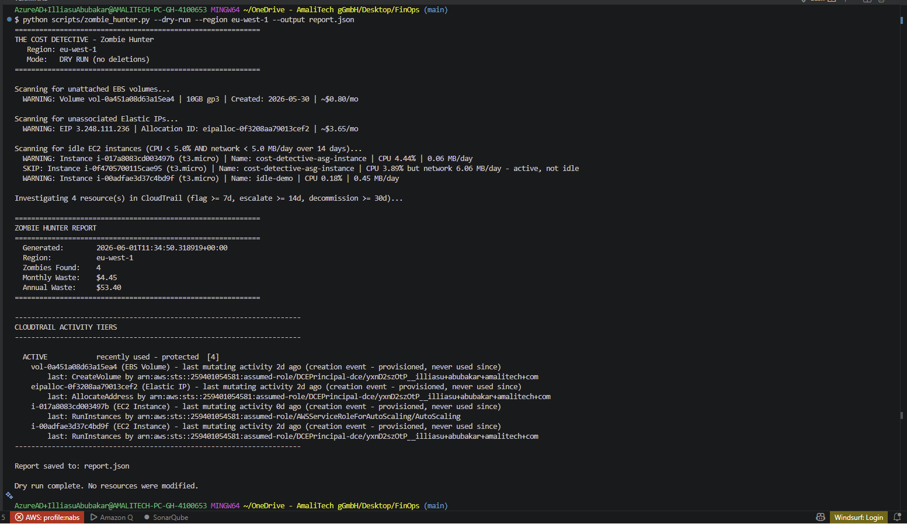

# Runbook: Zombie Resource Cleanup

**Purpose:** Safely identify and decommission wasteful AWS resources (unattached EBS volumes, unassociated Elastic IPs, idle EC2 instances) using `scripts/zombie_hunter.py`.

**Owner:** FinOps / Cloud Platform
**Region:** `eu-west-1`
**Audience:** Anyone authorized to review and decommission cloud resources.

---

## When to Use

- A weekly scanner report (from `lambda-scanner`) or a manual dry-run has surfaced potential waste.
- During a periodic cost-optimization sweep.
- In response to a budget alert (see also [budget-alert-response.md](budget-alert-response.md)).

**Golden rule:** Never delete based on resource state alone. Always investigate in CloudTrail first. This tool enforces that automatically, but the tiers must still be reviewed before running `--execute`.

---

## Prerequisites

1. Dependencies installed: `pip install -r requirements.txt`
2. Valid AWS credentials: `aws sts get-caller-identity` returns the expected account.
3. IAM permissions:
   - Detection: `ec2:DescribeVolumes`, `ec2:DescribeAddresses`, `ec2:DescribeInstances`, `cloudwatch:GetMetricStatistics`, `cloudtrail:LookupEvents`
   - Decommissioning: the above plus `ec2:DeleteVolume`, `ec2:ReleaseAddress`, `ec2:StopInstances`, `ec2:TerminateInstances`, and for the automatic backups `ec2:CreateSnapshot`, `ec2:CreateImage`, `ec2:CreateTags`, `ec2:DescribeSnapshots`, `ec2:DescribeImages`, `sts:GetCallerIdentity`

---

## Step 1: Detect (Always Start Read-Only)

```bash
python scripts/zombie_hunter.py --dry-run --region eu-west-1 --output report.json
```

This scans for waste, investigates each item in CloudTrail, prints a tier breakdown, and writes `report.json`. Nothing is modified.



Review the headline monthly and annual waste totals, then the tier breakdown.

---

## Step 2: Understand the Tiers

| Tier | Meaning | Required action |
|------|---------|-----------------|
| `EXEMPT` | Tagged `DoNotDelete` | Leave alone. |
| `ACTIVE` | Used within the last 7 days | Leave alone; recently touched. |
| `FLAG` | Idle 7 to 13 days | Notify the owner using the resource's `Owner` or `CostCenter` tag. Confirm it is not needed. |
| `ESCALATE` | Idle 14 to 29 days | Escalate for review. Likely waste, but confirm before the SAFE window. |
| `SAFE` | Idle 30 days or more | Eligible for decommissioning (Step 4). |
| `INCONCLUSIVE` | No CloudTrail activity found | Investigate manually (Step 3); do not assume idle. |
| `UNVERIFIABLE` | CloudTrail could not be queried | Fix permissions or credentials and re-run. Never deleted. |

---

## Step 3: Investigate Anything Uncertain

For `INCONCLUSIVE` items, or any resource that warrants a second check, review its full history:

```bash
python scripts/cloudtrail_tracker.py --resource-id <id> --region eu-west-1 --days 90
```

This shows the last API call, who made it, when, and a confidence verdict.

If a resource is intentionally retained (for example, a parked disaster-recovery volume), tag it so it is never flagged for deletion:

```bash
aws ec2 create-tags --resources <id> --tags Key=DoNotDelete,Value=true --region eu-west-1
```

---

## Step 4: Decommission (SAFE Tier Only)

The tool backs up before it deletes. There is no need to snapshot manually:

- EBS volume: a snapshot is created and verified (the tool waits for completion); the volume is deleted only if the snapshot succeeds, otherwise the delete is aborted.
- EC2 instance with `--terminate-idle-ec2`: an AMI is created and verified before termination. By default instances are only stopped, which is reversible and needs no backup.
- Elastic IP: cannot be snapshotted, so its address and tags are recorded before release.

Every action is written to a decommission manifest (`decommission-log-<timestamp>.json`) containing each backup ID and an exact rollback command.

### 4a. Run the Cleanup

```bash
python scripts/zombie_hunter.py --execute --region eu-west-1
```

The tool re-investigates, lists each SAFE-tier resource and the planned action (for example, "snapshot then delete"), and reports how many were held back. Type `yes` to proceed. Anything below SAFE is left untouched.

For non-interactive runs (use with care):

```bash
python scripts/zombie_hunter.py --execute --yes --region eu-west-1
```

### 4b. Stop Versus Terminate

By default SAFE instances are stopped (reversible). A stopped instance still bills for its EBS volumes and any Elastic IP, and will not be re-flagged. To remove instances fully (an AMI is taken first):

```bash
python scripts/zombie_hunter.py --execute --terminate-idle-ec2 --region eu-west-1
```

### 4c. Backup Options

```bash
# Wait longer for large-volume snapshots (default 600 seconds)
python scripts/zombie_hunter.py --execute --snapshot-wait-timeout 1800 --region eu-west-1

# Skip backups entirely (NOT recommended; no restore point)
python scripts/zombie_hunter.py --execute --no-backup --region eu-west-1
```

Backups are tagged with a retention value (`--snapshot-retention-days`, default 30) so a lifecycle policy can expire them and avoid accumulating snapshot cost.

---

## Step 5: Verify and Record

1. Confirm in the EC2 console (Volumes, Elastic IPs, Instances) that the SAFE items are gone or stopped.
2. Re-run with `--dry-run`; the decommissioned items should no longer appear.
3. Save the before and after `report.json` and record the realized monthly savings for the audit.

---

## Recovery and Rollback

The decommission manifest (`decommission-log-<timestamp>.json`) records the backup ID and exact rollback command for every action. Use it as the source of truth for recovery.

| Action taken | Recovery |
|--------------|----------|
| EBS volume deleted | Restore from the snapshot recorded in the manifest: `aws ec2 create-volume --snapshot-id <id> --availability-zone <az> --region eu-west-1`. If `--no-backup` was used, there is no recovery. |
| Elastic IP released | Allocate a new EIP; the specific address recorded in the manifest is not guaranteed to be reissued. |
| EC2 instance stopped | `aws ec2 start-instances --instance-ids <id>`. |
| EC2 instance terminated | Relaunch from the AMI recorded in the manifest: `aws ec2 run-instances --image-id <id> ...`. If `--no-backup` was used, there is no recovery. |

---

## Troubleshooting

| Symptom | Cause | Resolution |
|---------|-------|------------|
| `RequestExpired` or `ExpiredToken` | Temporary credentials expired | Refresh credentials and re-run promptly. |
| `InvalidClientTokenId` | Bad or empty credentials | Reconfigure (`aws configure`) or fix the profile. |
| Every resource is `UNVERIFIABLE` | Missing `cloudtrail:LookupEvents` | Grant the permission, or use `--skip-cloudtrail` for a state-only dry-run. |
| `RequestExpired` persists with fresh credentials | System clock skew | Enable automatic time synchronization on the machine. |
| Nothing detected but waste expected | Wrong region | Pass the correct `--region`. |

---

## Related

- Automated weekly detection: `terraform/lambda-scanner/` runs the same logic on a schedule; see [weekly-scan-review.md](weekly-scan-review.md).
- Budget-driven response: [budget-alert-response.md](budget-alert-response.md).
- Preventing future waste: [tagging-noncompliance.md](tagging-noncompliance.md) and the [tagging policy](../tagging-policy.md).
